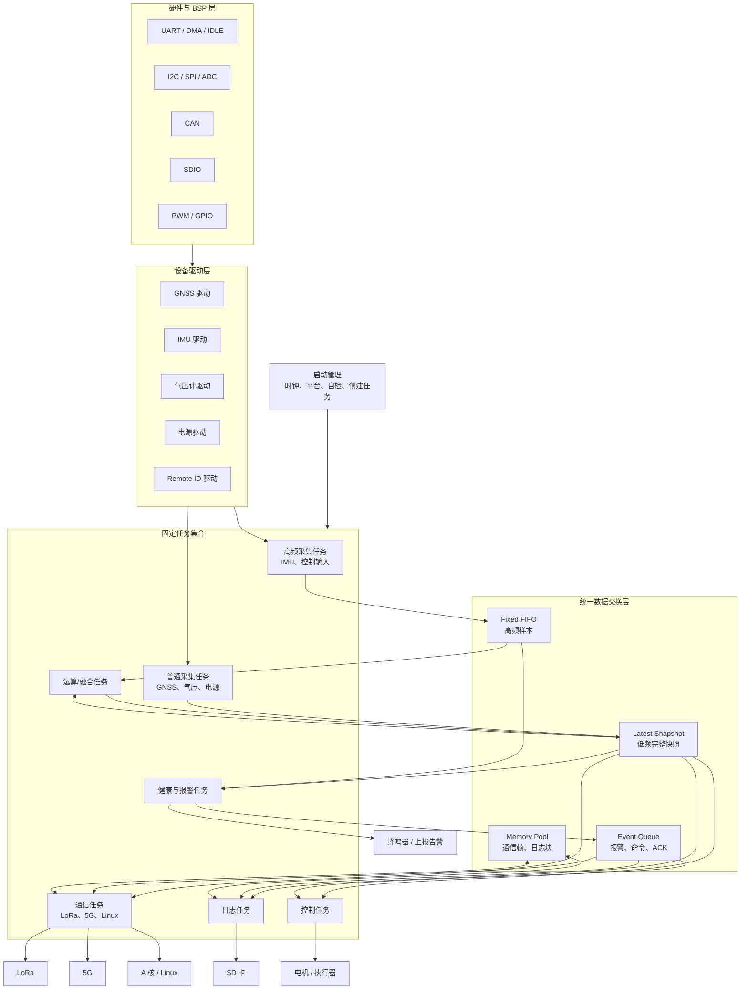

# 总体架构图



## 数据流边界

```text
BSP DMA 缓冲区
    -> 驱动解析后的私有状态
    -> 完整 Measurement
    -> Topic/FIFO/Event/Pool
    -> 运算、通信、日志和控制任务
```

任何上层模块都不得越过数据交换层直接读取 DMA 缓冲区。

## 任务扩展原则

功能增加时优先加入已有任务的周期调度表，而不是增加任务。

只有满足以下条件之一才允许新增任务：

- 有独立阻塞接口
- 有明确不同的实时优先级
- 需要独占不可重入资源
- 最坏执行时间会影响现有任务

新增任务必须附带栈预算和运行监控。
