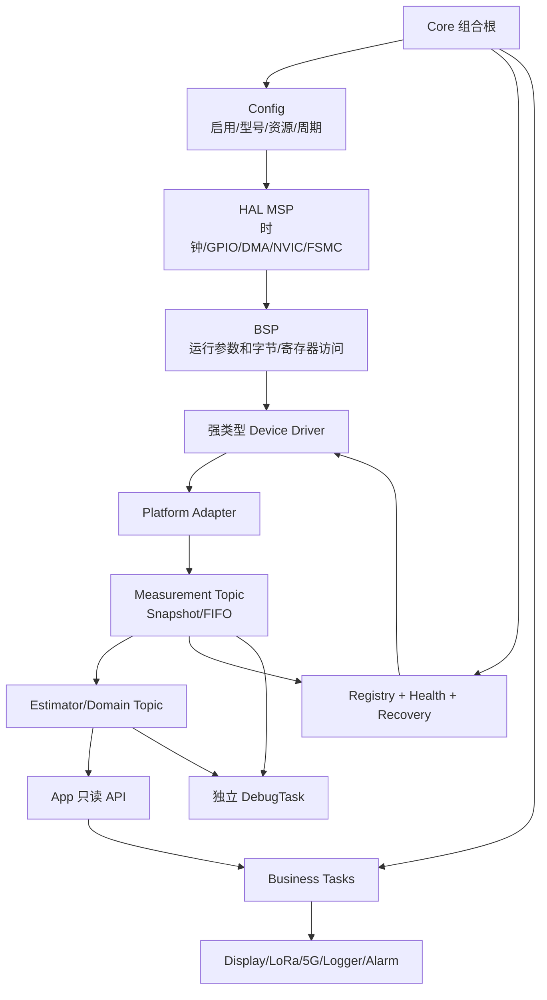

# Formal Framework 团队模块化开发手册

## 1. 手册目标

本手册规定所有成员如何新增外设、算法、任务、显示、通信、日志和告警模块，
以及如何在任务调度中找到并安全读取所需数据。

所有开发必须区分以下状态：

| 状态 | 含义 |
|---|---|
| 完成 | 真实实现、调用链闭合、通过编译和台架验证 |
| 基础完成 | 主流程可用，但恢复、算法或异常覆盖不完整 |
| 骨架 | 接口和结构存在，尚无完整生产者/消费者 |
| 占位 | 为架构和编译存在，不提供真实设备功能 |
| 预留 | 只有设计边界，未进入正式运行链 |

禁止把“存在头文件、队列、任务或函数声明”等同于功能完成。

## 2. 总体架构



完整可编辑图见 `12_总体模块图.mmd`。

## 3. 依赖方向

唯一允许的主方向：

```text
Core composition root
  -> Platform / Framework / Business initialization

Business
  -> App API / Framework public API

Framework
  -> Platform Adapter

Platform Adapter
  -> typed Driver / BSP

Driver
  -> BSP

BSP
  -> HAL / CMSIS
```

禁止：

```text
Framework -> Business
Driver -> Business/Display/LoRa/Logger
Business -> BSP/HAL/driver private variables
ISR -> parser/printf/SD/FSMC page rendering
```

`main.c` 是组合根，当前初始化顺序：

```c
HAL_Init();
SystemClock_Config();
DebugConsole_Init();
BSP_Init();
Px4Lite_PlatformInit();
Px4Lite_AppInit();
Business_AppInit();
vTaskStartScheduler();
```

## 4. 目录职责

| 目录 | 职责 | 不允许 |
|---|---|---|
| `Core` | 启动、组合根、中断入口、MSP、RTOS hooks | 设备协议和业务逻辑 |
| `Bsp` | 引脚、总线、DMA、FSMC、初始化参数、原始收发 | NMEA解析、融合、页面业务 |
| `Sensor` | 设备协议、强类型快照、标定和设备事实 | 直接创建业务任务 |
| `Framework` | Topic、FIFO、生命周期、Work、状态和Domain | include Business |
| `Business` | 应用任务、只读数据消费、事件分发 | 直接访问DMA和驱动私有变量 |
| `Debug` | 独立诊断任务和模块监控 | 推进正式采集流程 |
| `Development_Guide` | 强制规范、模板、变更和验收记录 | 被正式固件运行依赖 |

## 5. Config、MSP、BSP 和 Driver

### Config

`bsp_config.h` 统一定义：

- 外设是否启用。
- 型号、控制器和总线选择。
- GPIO、复用、DMA、IRQ、FSMC Bank。
- 默认波特率、时序和缓冲容量。

`px4lite_config.h` 定义：

- Framework 模块启用。
- Work 周期、超时、队列和任务栈。

配置头不能执行初始化，也不能包含设备命令序列。

### MSP

MSP 只负责 MCU 资源：

- 时钟。
- GPIO 模式和复用。
- DMA 和 NVIC。
- FSMC 引脚。

### BSP

BSP Init 才填写运行参数：

- UART 波特率。
- FSMC 数据宽度和读写时序。
- SPI/I2C 工作参数。
- DMA 模式和缓冲。

### Driver

Driver 实现设备协议和强类型数据：

```c
Module_Result_t Module_Init(void);
Module_Result_t Module_Service(Module_Snapshot_t *out);
```

高频设备允许采用：

```c
Module_Result_t Module_PushSample(...);
Module_Result_t Module_PopSample(...);
```

禁止恢复“通道编号 + 通用整数值”的旧传感器接口。

## 6. 数据模型选择

| 数据 | 模型 | 示例 |
|---|---|---|
| 低频完整状态 | Snapshot | GNSS、气压计、电池、健康 |
| 高频连续采样 | FIFO | IMU、振动、ADC波形 |
| 边沿事件 | Event Queue | 告警变化、命令结果、连接变化 |
| 多消费者业务事件 | EventBus | 日志通知、通信发送请求 |
| 大块数据 | Fixed Pool + Index | SD日志、5G大帧、图像块 |
| 外部通信 | Frame + CRC + TX状态机 | LoRa、5G、Linux IPC |

所有公开数据必须定义：

- 单位和缩放。
- 坐标系和正方向。
- `sequence`。
- `sample_time_ms`。
- `publish_time_ms`。
- `valid`、`quality` 和 flags。
- 最大数据年龄。

## 7. 新模块开发流程

完整细节图见 `13_模块接入与任务调用细节图.mmd`。

### 第一步：登记资源

在 `bsp_config.h` 中登记型号、引脚、DMA、IRQ和总线，不允许私自在 `.c`
文件中写魔法资源号。

### 第二步：实现 MSP 和 BSP

完成硬件初始化和最小读写测试。此阶段只证明总线可用，不创建业务任务。

### 第三步：定义强类型数据

例如：

```c
typedef struct
{
    uint32_t rx_sequence;
    uint32_t sample_time_ms;
    int32_t pressure_pa;
    int32_t temperature_cdeg;
    uint8_t valid;
    uint8_t quality;
} Baro_Snapshot_t;
```

### 第四步：实现 Driver

- `Init()` 重置设备私有状态。
- `Service()` 非阻塞推进采集并复制完整快照。
- 私有临时结构完成校验、标定和运算后一次性发布。
- ISR 只搬运数据、更新时间戳或计数器。

### 第五步：实现 Platform Adapter

Adapter 是设备类型转 Framework 类型的唯一转换位置：

- 单位转换。
- 字段映射。
- 数据事实映射。
- 驱动错误映射为 Framework Result。

### 第六步：注册生命周期

为模块提供：

```text
init -> self_check -> start -> run -> stop -> recover
```

缺失回调可以为空，但必须在模块评审中说明。

### 第七步：加入所有者任务

默认规则：

- 所有普通传感器由 `SensorTask` 持有。
- 高频 IMU 可由专用高优先级任务持有。
- 算法进入 `EstimatorTask`。
- 状态检查进入 `HealthTask`。
- FSMC LCD 只由 `DisplayTask` 写入。
- LoRa、5G、Logger 使用各自通信/存储任务。

同一硬件只能有一个任务所有者。

### 第八步：发布 Topic

低频发布 Snapshot，高频发布 FIFO。禁止任务直接共享驱动私有结构。

### 第九步：健康与恢复

每个模块必须定义：

- 启动宽限。
- 接收超时。
- 有效数据超时。
- 连续错误阈值。
- 恢复间隔和最大重试次数。
- ONLINE、DEGRADED、OFFLINE、FAILED 转换条件。

### 第十步：Debug 和验收

增加独立模块宏，例如：

```c
#define DEBUG_BARO_MONITOR_ENABLE 1U
```

联合资源测试时同时开启：

```c
#define DEBUG_STACK_MONITOR_ENABLE 1U
```

## 8. 任务调度中如何找到数据

任务开发者先判断需要的是“状态快照”“连续样本”还是“边沿事件”。

### Display、LoRa、5G、Logger

优先使用应用只读接口：

```c
App_CopyNavigation(&navigation, now_ms);
App_CopySystem(&system, now_ms);
App_CopyAlarm(&alarm, now_ms);
App_GetCommStats(&comm_stats);
App_GetModuleStatus(module_id, &status);
```

禁止调用 `Sensor_GNSS_Service()`、`BSP_GNSS_GetRxData()` 或访问 Topic 私有
静态变量。

Display 后续显示姿态、告警和链路状态时仍走上述 App 接口。姿态角和角速度
来自 Estimator 的 Navigation 快照,不要直接读取 MPU6050 驱动缓存。

### Framework 算法

算法模块可以读取 Framework Topic：

```c
Px4Lite_CopyGnss(&gnss);
Px4Lite_PopImu(&imu);
Px4Lite_CopyBaro(&baro);
Px4Lite_CopyBattery(&battery);
```

读取后必须检查返回值、`valid`、最大年龄和 flags。

### 边沿事件消费者

业务事件使用：

```c
Business_EventBusSubscribe(topic, subscriber);
Business_EventBusReceive(subscriber, &event, timeout);
```

EventBus 用于“发生了什么”，Snapshot 用于“当前是什么状态”。不得用事件
队列替代最新状态快照。

### Command/ACK

只有 `PX4LITE_ENABLE_COMMAND == 1U` 时队列才创建。关闭时接口返回
`PX4LITE_NOT_READY`。

### Alarm

只有 `PX4LITE_ENABLE_ALARM == 1U` 时 Alarm Queue 才创建。活动告警状态最终
由 Alarm Manager 管理，队列只传递变化事件。当前 Alarm Manager 挂在
Health 周期内运行,不新增任务;每个模块最多维护一个活动告警记录。

## 9. 当前任务表

| Task | 当前周期 | 当前优先级 | 所有权 |
|---|---:|---:|---|
| `sensor` | 10 ms | idle+4 | GNSS及普通传感器采集 |
| `estimator` | 20 ms | idle+3 | Domain转换和未来融合 |
| `health` | 100 ms | idle+2 | 状态、超时、看门狗门控 |
| `biz_system` | 1000 ms | idle+2 | 应用系统服务 |
| `biz_acq` | 200 ms | idle+2 | 应用快照分发 |
| `biz_display` | 10 ms | idle+1 | 触摸和分步刷新 |
| `debug` | 100 ms | idle+1 | 串口诊断 |

`sensor` 实际配置为 `idle+4`，高于 `biz_acq`。接入高频 IMU 前仍必须完成
执行时间和 deadline 测量，再决定是否建立专用更高优先级采集任务。

## 10. 并发和完整性强制规则

1. 一个设备只能有一个采集或写入所有者。
2. Snapshot 必须整结构一致性复制。
3. 高频 FIFO 必须定义溢出策略和统计。
4. 通信不得直接发送 C 结构体内存。
5. 部分发送不能视为发送成功。
6. ISR 禁止解析、格式化输出、SD写入和页面绘制。
7. 临界区必须保存并恢复原中断状态。
8. 大数组、帧缓冲和格式化缓冲不得放在高频任务栈。
9. `vTaskDelayUntil()` 用于周期任务。
10. 每个任务必须注册 Stack Monitor。
11. 队列、Pool 和静态 Buffer 必须声明所有者。
12. 关闭 Debug 后不得改变正式数据链和状态机。

## 11. FSMC Display 专项

ATK-MD0700 使用：

```text
FSMC 8080 16-bit + SSD1963类控制器 + GT911
```

强制规则：

- `bsp_config.h` 管理启用、型号、引脚和默认时序。
- MSP 配置 FSMC 和触摸/背光资源。
- BSP Init 设置 FSMC运行参数。
- SSD1963 Driver 管理LCD命令。
- DisplayTask 独占LCD写操作。
- 不分配 `800 x 480 x 2` 全屏内部SRAM缓冲。
- 使用LCD GRAM、脏矩形和小型行缓冲。

## 12. Debug 使用

各模块开关相互独立。当前配置以 `debug_config.h` 为准。

```c
DEBUG_STACK_MONITOR_ENABLE
DEBUG_GNSS_MONITOR_ENABLE
DEBUG_IMU_MONITOR_ENABLE
DEBUG_BARO_MONITOR_ENABLE
DEBUG_LORA_MONITOR_ENABLE
DEBUG_STORAGE_MONITOR_ENABLE
```

DebugTask 只能复制公开快照和统计，不得调用会推进采集流程的接口。

## 13. 故障、告警和恢复

状态恢复和硬件恢复不是同一件事：

- 新数据重新到来可使状态从 OFFLINE 回到 ONLINE/DEGRADED。
- DMA、UART、I2C或设备卡死需要调用 BSP Recover 和 Registry Recover。

后续恢复管理器必须根据连续错误、超时和退避时间调用：

```c
Px4Lite_RegistryRecover(module_id, now_ms);
```

当前已经固定调用点和配置契约：

```c
Px4Lite_RecoveryMonitorRun(now_ms);

#define PX4LITE_GNSS_RECOVERY_ENABLE       0U
#define PX4LITE_GNSS_ERROR_THRESHOLD       3U
#define PX4LITE_GNSS_RECOVERY_DELAY_MS  1000U
#define PX4LITE_GNSS_RECOVERY_MAX_RETRY    5U
```

默认关闭，不改变正式运行行为。只有完成 DMA/UART 卡死、断线和重复恢复故障
注入后，才允许在发布配置中改为 `1U`。

告警必须维护活动表，低级事件不得关闭仍然存在的高级告警。

## 14. 当前预留与未完成

| 项目 | 当前状态 | 使用限制 |
|---|---|---|
| Log Pool | 只有契约，功能宏为0 | 宏关闭时禁止调用且不分配资源 |
| Alarm Manager | 已维护活动告警表 | 消费者走 `App_CopyAlarm()` |
| Command/ACK | 按宏创建 | 尚无命令执行器 |
| IMU/Baro/Battery | 驱动已接入正式链路 | Debug只读换算/姿态结果 |
| Display | ATK-MD0700已接入 | 告警页面后续只读App快照 |
| Registry Recover | 接口完成 | 尚无自动恢复管理器 |
| VTG | 可识别 | 尚未解析，RMC为当前速度来源 |

VTG 后续接入检查项：

```text
[ ] 增加Nmea_ParseVTG()
[ ] 校验mode字段
[ ] 节与km/h单位一致性检查
[ ] 与RMC速度、航向交叉验证
[ ] 记录冲突计数
[ ] 明确RMC缺失时的回退优先级
```

## 15. 提交前验收清单

每个模块提交必须回答：

1. 使用了哪些引脚、DMA、中断和总线？
2. 谁是硬件唯一所有者？
3. 数据模型是 Snapshot、FIFO、Event 还是 Pool？
4. 单位、坐标系、频率和最大年龄是什么？
5. 状态、故障码、超时和恢复条件是什么？
6. 哪个任务调用，周期、优先级和执行预算是多少？
7. 消费者通过哪个 API 获取数据？
8. 是否存在半包、撕裂、队列满和缓冲覆盖风险？
9. Debug 宏是什么，关闭后是否不影响正式逻辑？
10. ARMCC5 是否 `0 Error / 0 Warning`？
11. Stack、Heap、deadline 和长时间运行结果是什么？
12. 文档和 Change History 是否同步？
