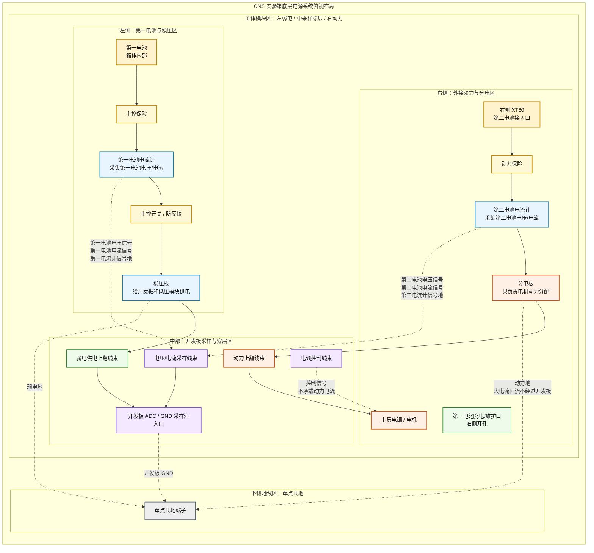

# CNS 实验箱底部电源系统布局建议

本文件用于指导 CNS 实验箱底部电源系统装配。当前结构采用上下两层设计：上层放开发板、传感器、屏幕、电调和电机等功能器件；底层只放电源、保护、分配、采样和穿层接口。箱体右侧开孔用于第一电池充电/维护接口和第二电池 XT60 动力接入。

## 1. 底层俯视布局图

下图按箱体实际左右方向绘制，采用“左侧弱电、中部穿层、右侧动力、下侧单点共地”的区间模块布局。连接线按用途分开：弱电供电线、动力供电线、采样线、控制线和地线尽量走独立线槽，避免互相穿插。

## 2. 布局重点

- 左右方向按箱体实际方向绘制：左侧为内置第一电池与稳压区，右侧为外接动力电池与分电区。
- 右侧开孔承担两个功能：第一电池充电/维护，第二电池 XT60 动力接入。
- 第一电池在箱体内部，第一电池与稳压板之间串接第一电池电流计。
- 第二电池为外接动力电池，进入箱体后先经过动力保险，再经过第二电池电流计，最后到分电板。
- 电流计同时负责电压、电流采样，其采样信号和信号地进入开发板 ADC/GND 采样入口。
- 稳压板只负责弱电供电；分电板只负责电机动力分配。两者之间不直接连接电源线、采样线或控制线。
- 开发板 GND、稳压板 GND、分电板 GND 最终汇到单点共地；动力大电流回流不得经过开发板、传感器或弱电线束。
- 弱电供电线、动力供电线、采样线、控制线和地线应分线槽固定，尽量平行分层走线，避免交叉缠绕。
- 穿层线束需要固定，穿孔处加护线圈，避免箱体边缘磨破绝缘皮。
