# 架构学习指南：模块流程与开发入门

> 适用工程：STM32F407 + HAL + FreeRTOS + Keil MDK-ARM  
> 当前代码根目录：`W:\WORK\Project\ff613\Formal_Framework13\Formal_Framework\Formal_Framework1`

本文用于学习本工程的整体架构、各模块调用流程、代码编写思路，以及如果从零开始写出类似代码应该怎么一步步落地。

---

## 1. 先理解这份代码的核心思想

这套代码不是把所有外设和业务逻辑堆在 `main.c` 里，而是按职责分层：

```text
Core -> Business -> Framework -> Platform Adapter -> Driver -> BSP -> HAL
```

每一层只做自己的事：

| 层级 | 主要职责 | 不能做什么 |
|---|---|---|
| Core | 启动、系统时钟、创建框架和业务任务 | 不写业务逻辑 |
| Business | 业务流程、显示业务、消息日志、远端选择 | 不直接读 BSP / Sensor / DMA |
| Framework | topic、模块注册、健康状态、恢复、通信调度 | 不包含 Business 头文件 |
| Platform Adapter | 把 BSP/Sensor 数据转换成 Framework 类型 | 不把 BSP 细节扩散到其他 Framework 文件 |
| Driver | 芯片协议、通信协议、设备内部状态 | 不直接调用 HAL |
| BSP | GPIO、UART、SPI、DMA、中断、原始收发 | 不做业务解析 |
| HAL | STM32 官方底层库 | 只作为 BSP 的底层依赖 |

本工程的核心设计目标是：

1. 一个硬件资源只有一个任务拥有者。
2. 数据先进入 Framework topic，再由 Business/Display/Comm 读取。
3. 显示、通信、日志都消费同源数据，不能各自维护一套影子状态。
4. 周期任务固定节奏运行，避免阻塞和动态分配。
5. 任务栈不能随便扩大，大对象尽量用文件级静态 scratch。

---

## 2. 总体启动流程

入口文件是：

`Core/Src/main.c`

启动主链路：

```text
main()
  -> HAL_Init()
  -> SystemClock_Config()
  -> DebugConsole_Init()
  -> BSP_Init()
  -> Px4Lite_PlatformInit()
  -> Px4Lite_AppInit()
  -> Business_AppInit()
  -> vTaskStartScheduler()
```

对应架构图：

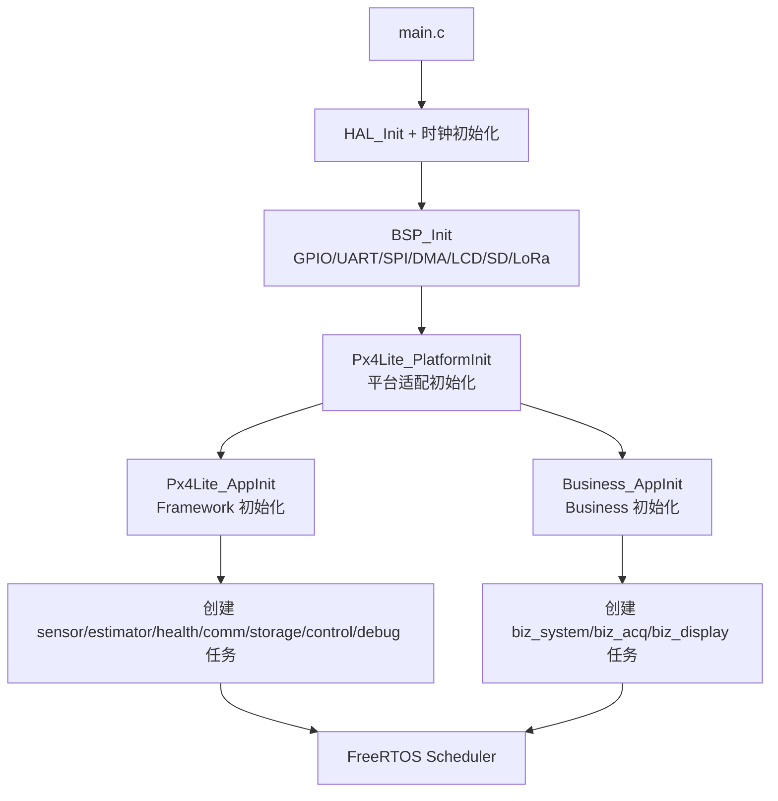

`main.c` 只做组合根，不承载具体业务。

---

## 3. Framework 固定任务

Framework 任务创建在：

`Framework/Src/px4lite_app.c`

主要任务：

| Task | 周期 | 主要入口 | 作用 |
|---|---:|---|---|
| sensor | 10 ms | `Px4Lite_SensorWorkRun()` | 统一采集 GNSS、IMU、Baro、Battery |
| estimator | 20 ms | `Px4Lite_EstimatorRun()` | 姿态、导航、气压高度、速度融合 |
| health | 100 ms | `Px4Lite_HealthRun()` | 超时、状态、告警、恢复、看门狗门控 |
| comm | 10 ms | `Px4Lite_CommWorkRun()` | LoRa RX、MAVLink TX/RX、RemoteID TX |
| storage | 50 ms | `Px4Lite_StorageWorkRun()` | SD CSV 日志 |
| control | 20 ms | `Px4Lite_ControlRun()` | 电机输出控制 |
| debug | 100 ms | `DebugService` | 自检、水线、诊断 |

任务调度图：

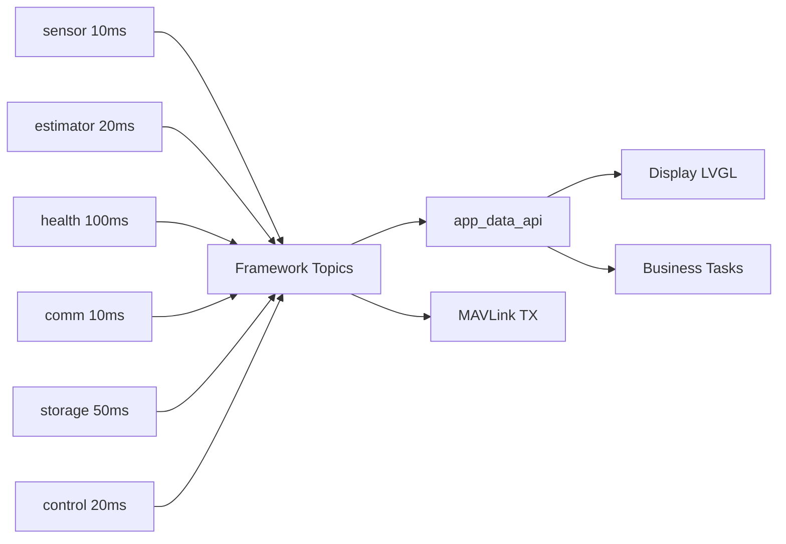

---

## 4. 数据发布模型

Framework 的数据中心在：

`Framework/Src/px4lite_topics.c`

它提供两类数据结构：

1. Latest-value topic  
   例如 GNSS、Baro、Battery、Navigation、Health。

2. FIFO / Queue  
   例如 IMU FIFO、Alarm Queue、Command Queue。

典型模式：

```c
/* Writer */
taskENTER_CRITICAL();
g_topic = *source;
g_topic_ready = 1U;
taskEXIT_CRITICAL();

/* Reader */
taskENTER_CRITICAL();
if (g_topic_ready) {
  *dest = g_topic;
}
taskEXIT_CRITICAL();
```

为什么这样做：

- 写入和读取都很短。
- 不做阻塞 I/O。
- 避免读到半更新数据。
- 不需要动态内存。

---

## 5. 传感器采集流程

相关文件：

| 文件 | 作用 |
|---|---|
| `Sensor/Src/sensor_gnss.c` | GNSS 驱动解析 |
| `Sensor/Src/sensor_mpu6050.c` | MPU6050 驱动 |
| `Sensor/Src/sensor_bme280.c` | BME280 驱动 |
| `Sensor/Src/sensor_power.c` | 主电池采样 |
| `Sensor/Src/sensor_power2.c` | 第二电池/外设供电采样 |
| `Framework/Src/px4lite_platform_f407.c` | Driver 类型转 Framework 类型 |
| `Framework/Src/px4lite_modules.c` | sensor task 发布 topic |

采集链路：

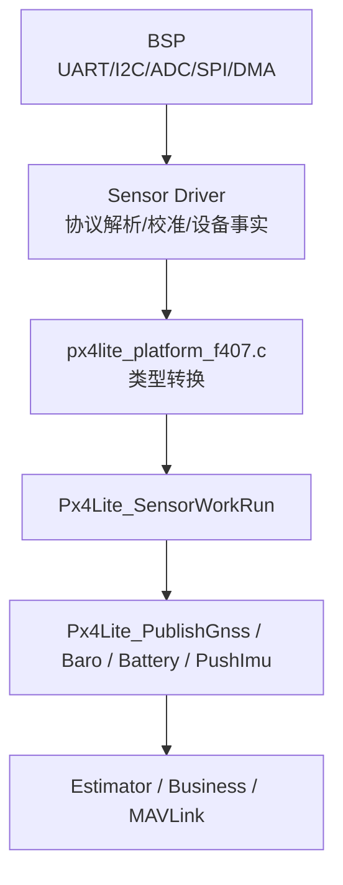

重点：

- 普通传感器不单独建任务。
- `sensor` 任务是普通传感器唯一采集者。
- IMU 用 FIFO，因为姿态解算可能一次消费多帧。
- GNSS/Baro/Battery 用 latest snapshot。

---

## 6. 姿态与导航融合流程

相关文件：

| 文件 | 作用 |
|---|---|
| `Framework/Src/px4lite_modules.c` | Estimator 主流程 |
| `Framework/Src/px4lite_attitude.c` | 姿态解算 |
| `Framework/Src/px4lite_topics.c` | Navigation 发布 |

流程：

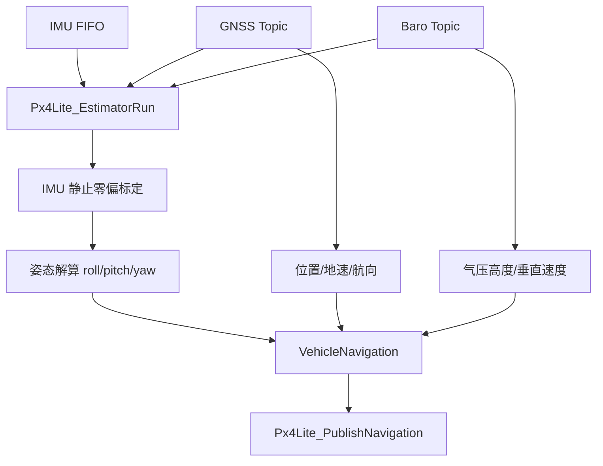

当前 Estimator 做的事：

- IMU 开机静止标定。
- 姿态质量评分。
- GNSS 位置、地速、航向。
- 气压高度、垂直速度。
- GNSS/Baro 高度融合。
- 最终发布 `Px4Lite_VehicleNavigation_t`。

---

## 7. Health、状态、告警和恢复

相关文件：

| 文件 | 作用 |
|---|---|
| `Framework/Src/px4lite_modules.c` | 状态和 Health 主逻辑 |
| `Framework/Src/px4lite_alarm.c` | 告警表 |
| `Framework/Src/px4lite_recovery.c` | 恢复监控 |
| `Framework/Src/px4lite_registry.c` | 模块注册和生命周期 |

状态链路：

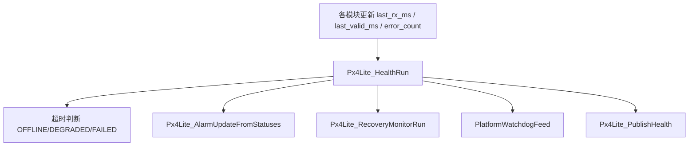

关键原则：

- Driver 记录硬件事实。
- Health task 统一做 OFFLINE / FAILED 判定。
- recover 回调只请求重初始化，不能在 health 任务里做总线 I/O。
- 看门狗只有在关键任务 heartbeat 都正常时才喂。

---

## 8. LoRa / MAVLink 通信流程

相关文件：

| 文件 | 作用 |
|---|---|
| `Driver/Comm/Src/lora_e22.c` | E22 驱动、UART/DMA、MAVLink 帧事实 |
| `Framework/Src/px4lite_mavlink_tx.c` | 本机 topic 编码成 MAVLink |
| `Framework/Src/px4lite_mavlink_rx.c` | 对端 MAVLink 解码成 RemoteTelemetry |
| `Framework/Src/px4lite_remote_telemetry.c` | 远端节点槽位 |
| `Business/Src/app_data_api.c` | 远端显示快照 |

通信发送：

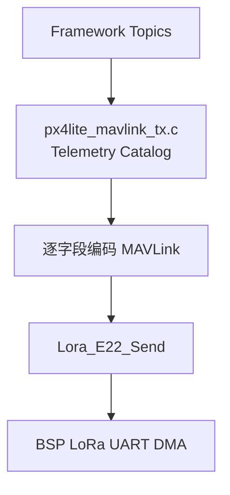

通信接收：

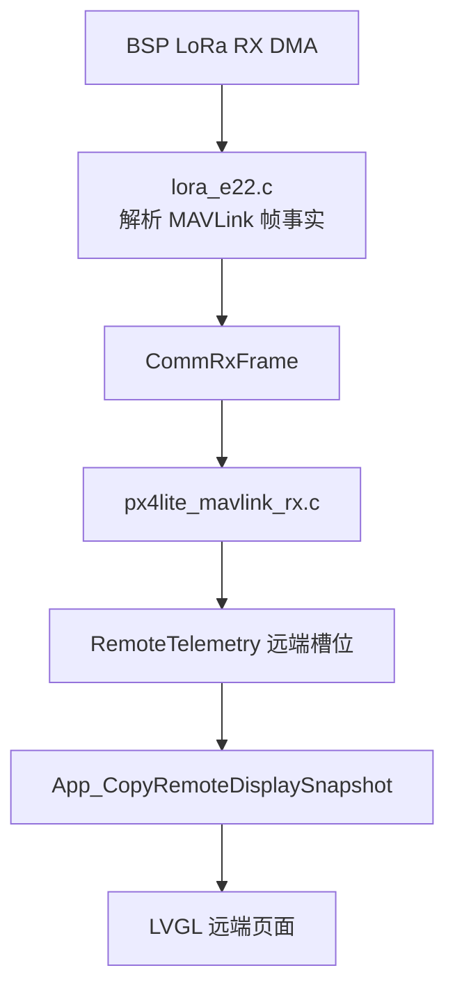

当前 LoRa 教学版规则：

- 不再使用主机/从机角色。
- 不再使用 VIEW 租约控制对端发送。
- 本机 LoRa 绿灯表示本机 E22 存在且服务健康。
- 对端是否有数据由远端槽位和远端页面体现。
- 发送方的 MAVLink `seq` 是帧编号。
- 丢包率在接收侧根据 `system_id + seq` 估算。
- 远端显示数据通过 catalog 分项同步，不发送一个大结构体。

Telemetry Catalog 包含：

- `HEARTBEAT`
- `GPS_RAW`
- `GNSS_DETAIL`
- `ATTITUDE`
- `POSITION`
- `SYS_STATUS`
- `MODULE_STATE`
- `BATTERY`
- `BAT2STAT`
- `GNSSUTC`
- `PRESSURE`
- `ENV_HUM`
- `ALARM`
- `STATUSTEXT`
- `MOTOR`
- `LOGSYNC`

---

## 9. RemoteID 流程

相关文件：

| 文件 | 作用 |
|---|---|
| `Framework/Src/px4lite_remoteid_tx.c` | RemoteID MAVLink/OpenDroneID 编码 |
| `Bsp/Src/bsp_remoteid.c` | UART4 TX DMA 原始发送 |
| `Framework/Src/px4lite_modules.c` | RemoteID 状态和恢复 |
| `Framework/Src/px4lite_identity.c` | DCDW 名称和 STM32 UID |

流程：

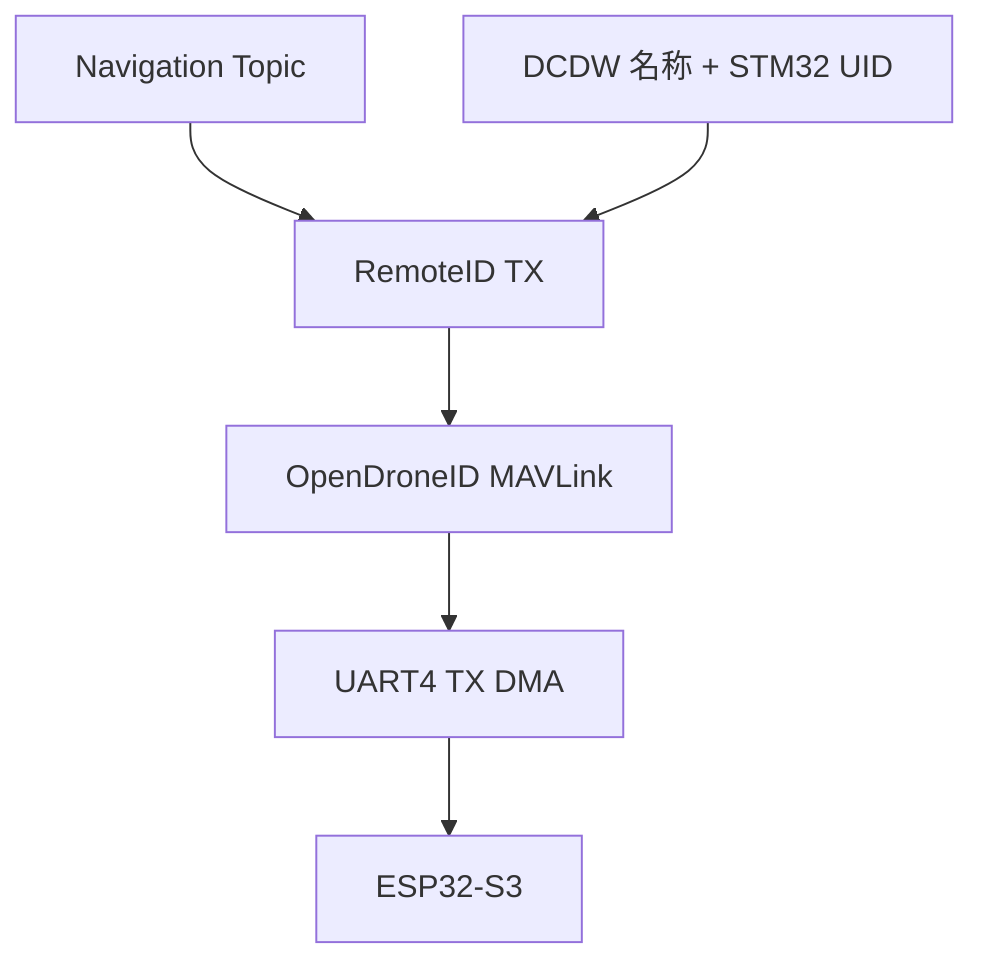

注意：

- 当前 RemoteID ONLINE 只表示 STM32 到 ESP32 的本地发送通道健康。
- 不代表 ESP32 已经完成 BLE/Wi-Fi 广播。
- 如果后续要判断 ESP32 真实在线，需要加 GPIO presence、UART RX ACK 或 ESP32 心跳。

---

## 10. Business 和 Display 流程

相关文件：

| 文件 | 作用 |
|---|---|
| `Business/Src/business_task_registry.c` | Business 任务创建 |
| `Business/Src/business_task_template.c` | biz_system / biz_acq / biz_display |
| `Business/Src/app_data_api.c` | 统一数据读取入口 |
| `Display/Src/display_lvgl.c` | LVGL 页面和交互 |

Business 任务：

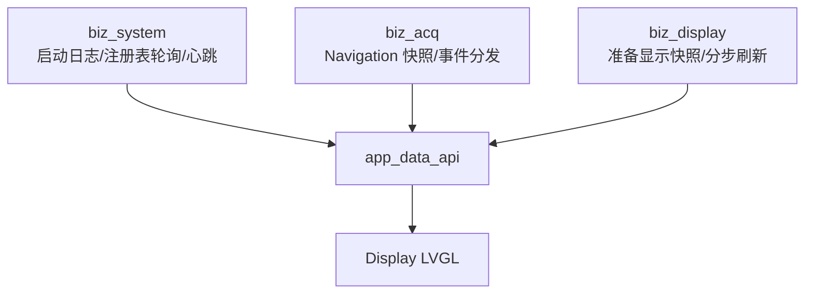

Display 原则：

- Display 不读 Framework topic。
- Display 不读 BSP。
- Display 只消费 App 层聚合好的显示变量。
- 页面刷新分步执行，避免 10 ms 显示任务阻塞。

本机显示入口：

`App_CopyDisplaySnapshot()`

远端显示入口：

`App_CopyRemoteDisplaySnapshot()`

---

## 11. Storage 流程

相关文件：

| 文件 | 作用 |
|---|---|
| `Storage/Src/storage_sd.c` | FatFS 文件服务 |
| `Storage/Src/storage_csv.c` | CSV 行格式 |
| `Framework/Src/px4lite_storage.c` | Framework storage work |
| `Storage/Src/diskio_sd_spi.c` | SD SPI diskio |

流程：

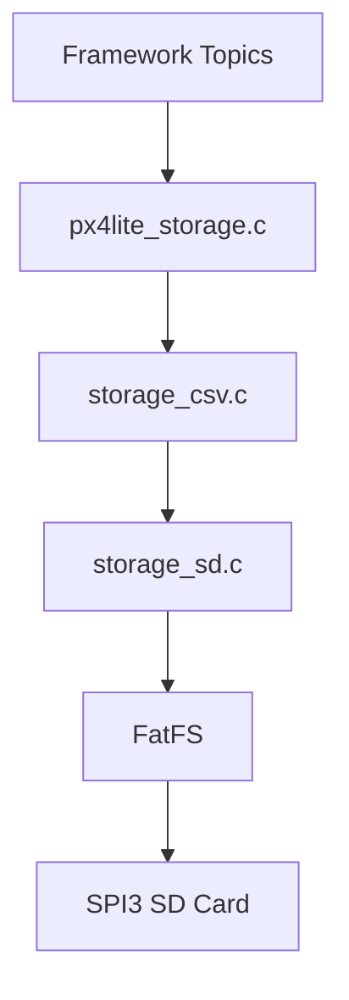

特点：

- Storage 任务低优先级。
- 不纳入 watchdog heartbeat。
- SD 热插拔失败后会清理 FatFS/diskio 状态再重新挂载。
- 写入失败会进入降级状态，避免红绿反复跳。

---

## 12. 如果从零写这套代码，应该怎么开始

建议按以下顺序写，不能一开始就写显示和 LoRa，否则很容易乱。

### 第 1 步：先搭 Core 和 BSP

目标：

- `main.c`
- `SystemClock_Config`
- `BSP_Init`
- GPIO / UART / I2C / SPI / DMA / RTC 基础初始化
- `Error_Handler`

此阶段只验证：

- Keil 能编译。
- 板子能启动。
- 基础串口/LED/延时正常。

不要写业务逻辑。

### 第 2 步：建立 Platform Adapter

目标：

- 创建 `px4lite_platform.h/.c`
- 提供统一时间接口：`PlatformGetMs`
- 提供硬件 UID、RTC、Watchdog 等平台服务
- 建立 BSP/Sensor 到 Framework 类型的转换口

原则：

- Framework 其他文件不能直接 include BSP。
- 所有 BSP 细节收口在 Adapter。

### 第 3 步：定义 Framework Types 和 Topics

目标：

- 定义 `Px4Lite_TopicHeader_t`
- 定义 GNSS、IMU、Baro、Battery、Navigation、Health 等结构体
- 写 `Px4Lite_Publish*` 和 `Px4Lite_Copy*`
- IMU 用 FIFO，普通快照用 latest-value

这一层写好后，后面所有模块都有统一数据容器。

### 第 4 步：写 Registry 和 Module 状态

目标：

- 模块枚举：GNSS、IMU、BARO、BATTERY、LORA、DISPLAY、STORAGE 等
- 模块 descriptor：init/start/recover
- 模块状态：UNINITIALIZED、STARTING、ONLINE、DEGRADED、OFFLINE、FAILED

这一层决定外设生命周期和状态灯来源。

### 第 5 步：写 FreeRTOS 固定任务

先建最小任务：

- `sensor`
- `estimator`
- `health`
- `comm`

每个任务都用：

```c
vTaskDelayUntil(&last_wake, pdMS_TO_TICKS(period_ms));
```

不要在任务里直接阻塞等待外设。

### 第 6 步：接入传感器

顺序建议：

1. GNSS
2. IMU
3. Baro
4. Battery

每接一个传感器，都要完成：

```text
BSP 初始化
Sensor Driver
Platform Adapter Read
SensorWorkRun 发布 topic
Health 超时状态
App API 读取
Display 显示
MAVLink 外发
```

不要只写 Driver 就说完成。

### 第 7 步：写 Estimator

先从简单开始：

1. GNSS -> Navigation 位置。
2. IMU -> roll/pitch/yaw。
3. Baro -> 气压高度。
4. GNSS/Baro 高度融合。
5. 质量评分。

发布统一 `Navigation` topic。

### 第 8 步：写 Health / Alarm / Recovery

目标：

- 超时判断。
- 模块状态快照。
- 告警表。
- 恢复请求。
- 看门狗喂狗门控。

注意：

- Health 不直接做 I/O。
- recover 只设置请求标志。
- 真正重初始化由资源所属任务执行。

### 第 9 步：写 Business API

目标：

- `App_CopyNavigation`
- `App_CopySystem`
- `App_CopyEnvironment`
- `App_CopyAlarm`
- `App_CopyDisplaySnapshot`
- `App_CopyRemoteDisplaySnapshot`

Business 和 Display 以后只能走这里。

### 第 10 步：写 Display

目标：

- LVGL 初始化。
- 页面切换。
- 状态灯。
- 本机数据页。
- 远端数据页。
- 消息日志。
- 告警页。

原则：

- Display 不直接读 Framework。
- Display 不直接读 BSP。
- Display 使用 App 层准备好的变量。

### 第 11 步：写 LoRa/MAVLink

顺序：

1. BSP UART/DMA RX/TX。
2. E22 Driver 状态机。
3. MAVLink RX 解析成帧事实。
4. MAVLink TX catalog 分项发送。
5. RemoteTelemetry 远端槽位。
6. App 远端显示快照。

不要发送 C struct。

正确方式：

```text
每个数据项 -> 一个 MAVLink 原生消息或 NAMED_VALUE_INT 扩展帧 -> 逐字段编码
```

### 第 12 步：写 Storage

目标：

- SD mount。
- 打开 CSV 文件。
- 周期写数据。
- 写错误日志。
- 热插拔恢复。

Storage 是低优先级服务，不要影响 sensor/comm/display。

### 第 13 步：补 Debug / Selftest / 文档

目标：

- 任务水线。
- heap 水位。
- 模块自检。
- LoRa/GNSS/SD/Display 状态。
- 文档和 Change_History。

每次新增外设都要同步文档。

---

## 13. 新增外设时的标准流程

如果以后接 5G、RemoteID 新硬件、其他传感器，都按这个流程：

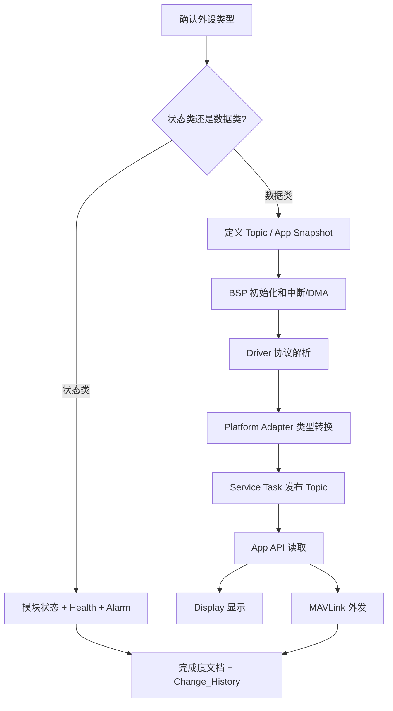

检查清单：

- HAL config 是否配置。
- Keil 工程 source list 是否加入。
- BSP GPIO/clock/DMA/NVIC 是否完整。
- ISR 是否只做轻量事件。
- Driver 是否不直接调用 HAL。
- Platform Adapter 是否是唯一 BSP 入口。
- Topic 是否有 timestamp、sequence、valid、quality。
- Health 是否有超时和恢复。
- Alarm 是否能上报。
- Display 是否只通过 App API。
- MAVLink 是否逐字段编码。
- 是否没有新增大栈对象。
- Keil Rebuild All 是否 0 Error / 0 Warning。

---

## 14. 读代码建议顺序

第一次学习建议按这个顺序打开文件：

1. `Core/Src/main.c`
2. `Framework/Src/px4lite_app.c`
3. `Framework/Inc/px4lite_config.h`
4. `Framework/Src/px4lite_topics.c`
5. `Framework/Src/px4lite_modules.c`
6. `Framework/Src/px4lite_platform_f407.c`
7. `Business/Src/app_data_api.c`
8. `Business/Src/business_task_template.c`
9. `Display/Src/display_lvgl.c`
10. `Driver/Comm/Src/lora_e22.c`
11. `Framework/Src/px4lite_mavlink_tx.c`
12. `Framework/Src/px4lite_mavlink_rx.c`
13. `Framework/Src/px4lite_remoteid_tx.c`
14. `Storage/Src/storage_sd.c`

读的时候不要先看细节函数，先抓住这三条主线：

```text
启动线：main -> AppInit -> task
数据线：Driver -> Adapter -> Topic -> App API -> Display/Comm
状态线：Module status -> Health -> Alarm -> Display/MAVLink
```

---

## 15. 最重要的编写习惯

1. 先定义边界，再写函数。
2. 先写数据结构，再写业务。
3. 先让 topic 流起来，再做显示和通信。
4. 每个任务只拥有自己的硬件资源。
5. 不在 ISR、Health、Display 里做重 I/O。
6. 不在任务栈上放大对象。
7. 不发送 C struct 内存。
8. 所有外设完成都必须闭环到：初始化、读取、状态、恢复、告警、显示、通信、文档、构建验证。

如果能守住这几条，这份工程就会越来越清楚，不会越接外设越乱。

