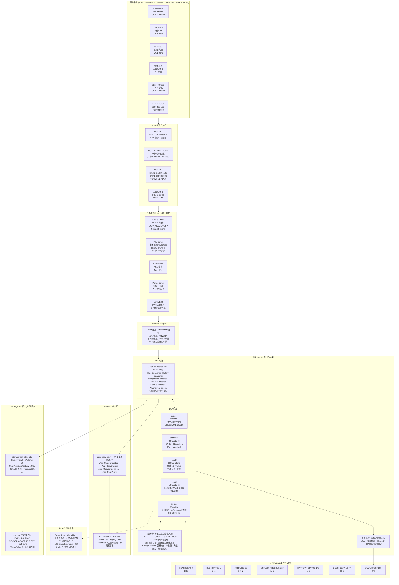
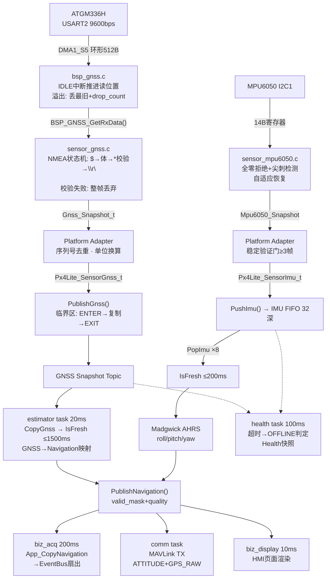
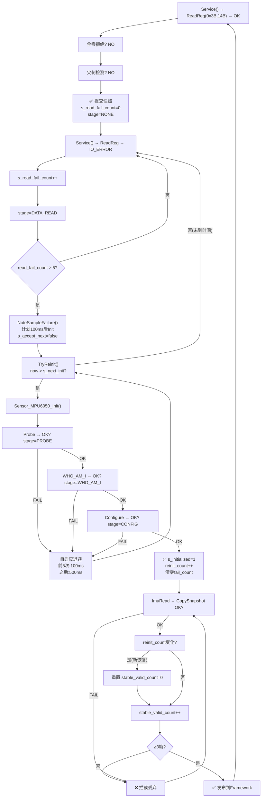
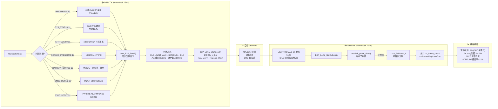
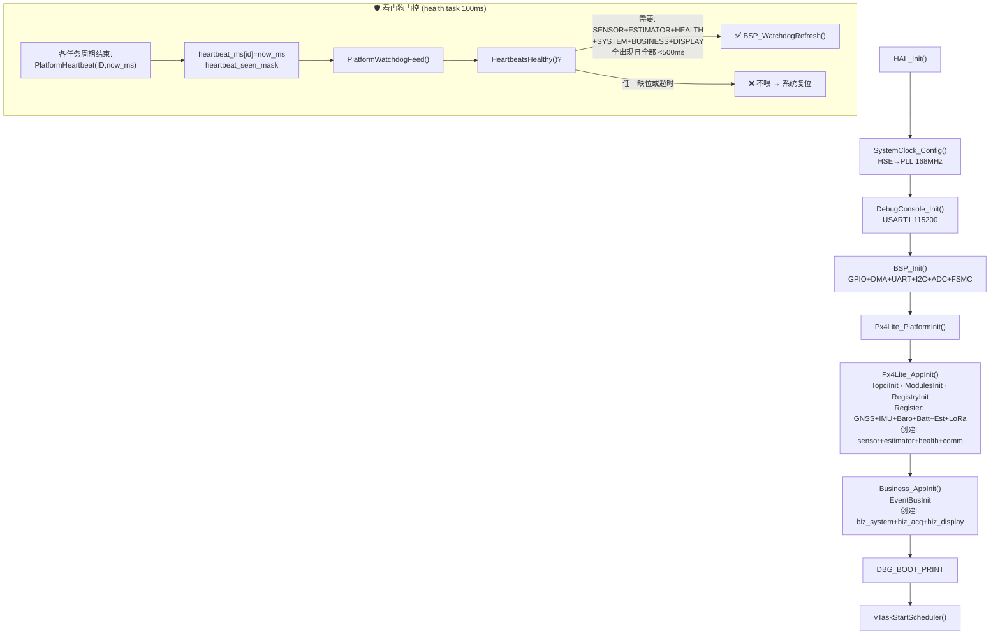
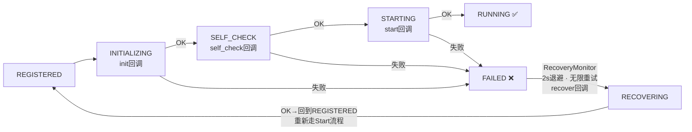

# STM32F407 Formal Sensor Framework — 架构流程图

> 版本: Formal_Framework11 | 2026-06-15 | 9运行任务 · 8种MAVLink消息 · 热插拔恢复 · SD CSV 日志(注册式)

---

## 一、系统总体架��图



---

## 二、GNSS 全链路数据流（最完整闭环）



---

## 三、IMU 热插拔自适应恢复（FF11 核心优化）



---

## 四、MAVLink 收发链路



---

## 五、启动与看门狗门控



---

## 六、模块生命周期



---

## 七、整体架构优势

```
┌─────────────────────────────────────────────────────────────────┐
│  ① PX4架构理念适配MCU                                             │
│  uORB Topic → Snapshot/FIFO静态数组 · Module Lifecycle → 独立注册表 │
│  Health & Fault → 超时判定+告警 · Recovery → 通用遍历恢复引擎      │
├─────────────────────────────────────────────────────────────────┤
│  ② 5层单向依赖解耦    Core→Business→Framework→Adapter→Driver→BSP  │
│  每层职责边界明确 · 新传感器只需加描述符即可接入                      │
├─────────────────────────────────────────────────────────────────┤
│  ③ 数据完整性三重保障                                              │
│  防半包(NMEA状态机) · 防撕裂(临界区复制) · 发送确认(TC回调)         │
│  IMU: 全零拒绝+尖刺检测+稳定验证门                                  │
├─────────────────────────────────────────────────────────────────┤
│  ④ 热插拔容错                                                      │
│  通用恢复引擎+IMU自适应退避 · recover回调设标志位(不碰总线)          │
│  恢复后稳定验证门 拦截起振垃圾数据                                   │
├─────────────────────────────────────────────────────────────────┤
│  ⑤ MAVLink v2 8消息全面遥测                                       │
│  HEARTBEAT · SYS_STATUS · ATTITUDE · SCALED_PRESSURE              │
│  BATTERY_STATUS · GNSS_DETAIL · STATUSTEXT · 地面站原生支持         │
├─────────────────────────────────────────────────────────────────┤
│  ⑥ 独立诊断 · 运行稳定                                             │
│  8模块独立Debug · DebugTask不参与喂狗 · 堆62% · 栈全部>25%         │
│  ARMCC5 0 Error / 0 Warning                                       │
└─────────────────────────────────────────────────────────────────┘
```
